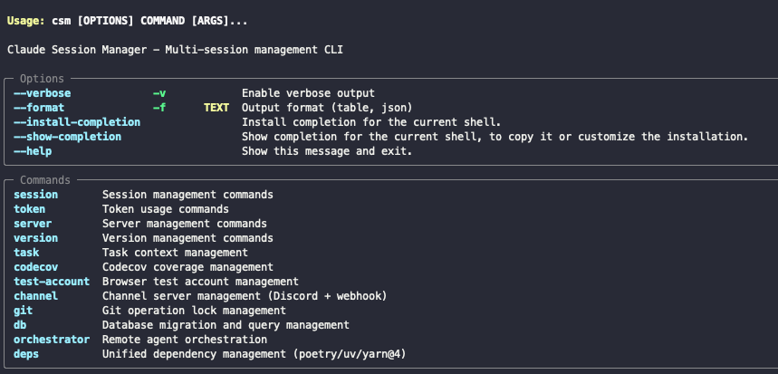
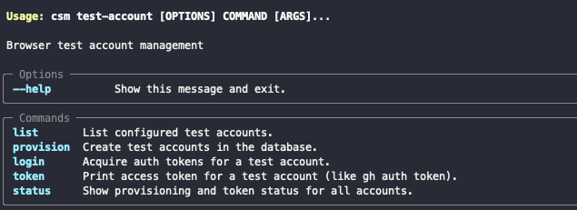

# Claude Code를 더 똑똑하게 쓰는 법 — 6개월 후 (Hooks에서 Harness로)

안녕하세요 조율자 여러분

작년 11월에 Claude Code Hooks 관련해서 글을 작성 했는데, 해당 기법이 최근에 ‘하네스’라는 이름으로 불리는걸 보고 비슷한 고민을 하고 계신 분들이 많다는걸 알게 되어 반가웠습니다.

관심 있으신 분들은 아래 글을 한 번 읽어주세요
https://www.reddit.com/r/ClaudeAI/comments/1osbqg8/how_to_make_claude_code_work_smarter/

당시 해당 스크립트를 계속 업데이트 할 생각이었지만, 훅이 늘어나고 Multi Session 사용에 따른 Lifecycle 주기 관리가 힘들어지면서 전체 리팩토링을 했고, 이전에 공유했던 Hook 스크립트 모음을 'Pace'라는 이름의 Claude Code Plugin 규격에 맞는 형식으로 현재 사용중입니다.
제 환경에 맞춰져 있고 다른 프로젝트를 같이 진행하다보니 코드는 아직 공개되어 있지 않은 상태입니다.



현재 CSM으로 되어 있지만 Pace로 변경됩니다.

다시 Claude Code로 돌아갑시다.

제 철학은 이전과 동일합니다.

**Claude Code는 적절한 제어를 하고 나아갈 방향을 제시해줄때 최적의 결과물을 출력합니다.**

물론 이것이 당장 프로덕션 규격의 품질이 나온다라는 말은 아닙니다.

다만 일반적인 상황에서 CLAUDE.md, AGENTS.md 등만 조정하고 기능이 최소 3개 이상 되는 프로그램을 만들었을 때 차이는 눈으로 명확하게 볼 수 있을 정도의 퀄리티 차이가 발생합니다.

현재 Pace는 이전에 제가 제시한 제한보다 더 강력하고 나아갈 방향을 제시를 해주는 방향으로 구성되었습니다.

각 섹션에 맞는 CLI Tools를 기본으로 제공하고, 제 환경의 Claude Code는 직접적인 Linux command 사용이 최대한 제한되어 있습니다.

이는 이전 제 글에도 말했듯이 동일한 행동을 여러번 한다고 했을 때 Claude Code는 명령어 구성을 자기 마음대로 합니다.

한때는 제가 Claude Code에게 물어봤습니다.

**“왜 동일한 결과가 나오는데 명령어를 다르게 사용하고, 때때로는 해당 명령어도 제대로 사용하지 못해서 출력을 하지 못하는 이유가 대체 뭐냐”**

이런 답변이 돌아왔습니다.

**“죄송합니다. 최대한 빠르고 효율적으로 진행하려고 하다보니 지침을 우선하지 않고 제 판단으로 진행했습니다.”**

이 답변으로 저는 확신을 했습니다.

AI LLM이 많은 발전을 했지만, **적어도 제가 사용하는 범위에서는 효율적이라는 단어와 빠르게 라는 단어를 아직 제대로 이해하지 못한다고**.

이는 제가 기존에 구현한 CLI Tools 구성에 조금 더 많은 시간을 들일 수 있는 계기가 되었고, 현재 제 Claude Code는 일반적인 find, ls 같은 기본 명령어 외에 조금 더 복잡해지는 sed를 이용한 파일 수정, find를 이용한 파일 수정, 멋대로 nohup 등을 사용해서 오류가 발생했는지 안했는지 확인을 하지도 않고 해당 프로세스를 기다린다고 sleep 400등, 대부분의 세션 블럭이나 코드 구조 자체가 망가질 수 있는 명령어는 사전에 차단하고 다른 대안을 제시합니다.
(이 부분은 이전 글의 훅과 동일한 기능을 하지만 내부적으로는 차단 방식이나 패턴 파악이 많이 개선되었습니다.)

특히 이 부분은 제가 통합 Auth module을 현재 만들고 있는데 이 모듈을 만들고 테스트하기 위해 테스트 계정을 이용해서 playwright 스크립트를 통한 쿠키 로그인이나 Bearer 로그인 방식에서 확실하게 차이를 냈습니다.



테스트 계정을 사용하기 위한 CLI

이 CLI를 만들기 전에는 Claude Code가 모듈 테스트를 위해 로그인 하는 부분만 약 10분 이상이 소요되었습니다.

이 모듈은 개발 과정에서도 디바이스 인증, 세션 연결, MFA, 핑거프린트 체크, RBAC 등 흔히 개발 중에는 생략되는 부분들이 전부 활성화된 상태에서 개발되고 있습니다.

문제는 Claude Code에게 계정 정보를 사전에 알려줘도, 매번 테스트할 때마다 또는 세션이 변경될 때마다 다른 계정을 사용한다는 겁니다.

있지도 않은 데이터베이스를 찾고, 사용자가 없다고 사용자를 다시 만들기도 하고, 완전히 잘못된 데이터베이스를 바라보고 비밀번호가 맞지 않다며 해시를 자기 마음대로 바꿔버리는 등 — 어떻게든 우회 방안을 찾으려 시도하면서 토큰을 태워먹고 컨텍스트를 낭비합니다.

**그리고 결국 실패합니다.**

그래서 테스트 계정 전용 CLI를 만들었고 해당 CLI는 현재 작업중인 프로젝트별 설정을 사용해서 정확한 데이터베이스에 프로젝트에 맞는 방식으로 계정을 생성하고 필요하다면 MFA를 활성화 하고 TOTP를 관리하며 로그인에 필요한 디바이스 정보까지 가지고, Claude Code가 토큰을 요구할 시 만료된 토큰이라면 Auto Refresh 기능도 포함되어 있습니다.

여기에 playwright script 테스트를 위한 Cookie 주입 방식 로그인, Input box 입력을 통한 다이나믹 로그인, Bearer 방식으로 curl 테스트를 위한 토큰 제공까지 CLI에서 모두 제공합니다.

이 CLI 레퍼런스를 메모리에 기록하고 로그인 시도를 수동으로 할 경우 차단하고 해당 CLI를 안내했을 경우 Claude Code는 필요한 권한에 맞게 정확하게 로그인을 하고 테스트를 진행하는 스크립트 작성을 빠르게 성공했습니다.

이 글에서 모든 기능 소개는 어렵지만 다른 CLI 구성도 비슷합니다.

대부분 Claude Code가 Raw command로 실행하는 부분을 사전에 fix시켜두고 해당 CLI만 사용하도록 강제하는 방식입니다.

오늘은 이 정도에서 글을 마칠까 합니다.

추가로 이전 글에서 제 CLAUDE.md 구성을 보고 싶다라고 말씀하신 분이 계셔서 첨부합니다.
연결된 critical.md, project.md, rules.md 전부 제 기준 파일이라 여러분들과는 맞지 않을 수 있어 이번에는 올리지 않았습니다.

다만 연결된 3개 파일들도 각 파일별 최대 200 라인 정도의 업무 매뉴얼 수준 지침입니다.

```
## Core

@core/critical.md
@core/project.md
@core/rules.md

---

## Plugins

### cc-session-manager
Skill/CLI 상세는 `critical.md`, 우선순위 규칙은 `rules.md` 참조.
```

다음에는 가능하다면 Pace 정식 버전을 소개하는 글이 되었으면 저 자신이 매우 기쁠 것 같습니다.

오늘도 긴 글을 읽어주셔서 감사합니다.

좋은 하루 되세요!

---

- 이 글 원문은 한국어로 작성되었고, DeepL을 이용해서 번역되었습니다.
- 이에 제가 의도하는 바와 다르게 전달이 될 수 있습니다.
- 문제가 있거나 문의가 있다면 얼마든지 댓글 달아주세요.
- 제가 관리중인 글 또는 오픈 프로젝트는 https://devsaurus.notion.site/ 사이트에서도 확인이 가능합니다.
